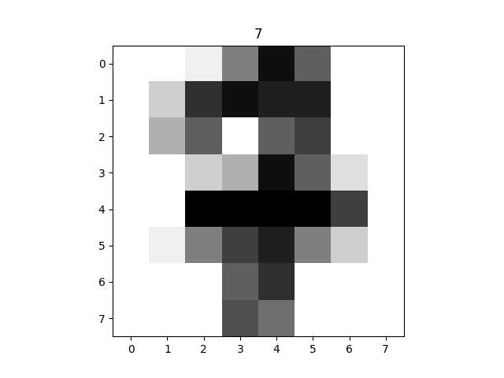

# Handwritten Digit Classification

## Table of Contents
+ [Configuration](#configuration)
+ [Data Overview](#data-overview)
+ [Modeling](#modeling)
  + [Support Vector Classifier](#support-vector-classifier)
  + [Decision Tree Classifier](#decision-tree-classifier)
  + [Random Forest Classifier](#random-forest-classifier)
+ [Model Analysis](#model-analysis)
  + [Model Prediction](#model-prediction)
+ [References](#references)

## Configuration
This project was written 100% in python, using the following libraries and versions:
```
Python:  3.11.1
TensorFlow:  2.12.0
scikit-learn:  1.2.2
Pandas:  2.0.2
NumPy:  1.23.5
MatPlotLib:  3.7.1
```

## Data Overview
Before getting into the classification, it is important to understand the data we are working with. The data provided is a set of 1797 handwritten digits that have been taken and converted to 8x8 images and each labeled with the number they should be. For example, this is what one 7 in the set looks like.



## Modeling
### Support Vector Classifier
A support vector classifier classifies objects by creating hyperplanes(decision boundaries) between data points that allow them to classify the data points. Hyperplanes can have a variety of dimensions based on the number of input features.


### Decision Tree Classifier
A decision tree classifier takes a veriety of test questions and organizes them and their outputs into a decision tree.

### Random Forest Classifier
A random forest classifier draws off of the decision tree classifier instead using multiple decision trees. For my random forest classifier, I used 150. In a random forest classifier, each tree will make its own independent predicition, the random forest will then output the most popular prediction.

## Model Analysis
I started my model analysis with this scatterplot of the results of the classification from each model, but I was somewhat unsatisfied with this and I wanted a way to show which one was objectively better than the others. Also another thing this showed was that there was a decrease in all model's accuracy around the training set size of 1600. What I think will fix this is to shuffle the order that the data is interpreted each time.


